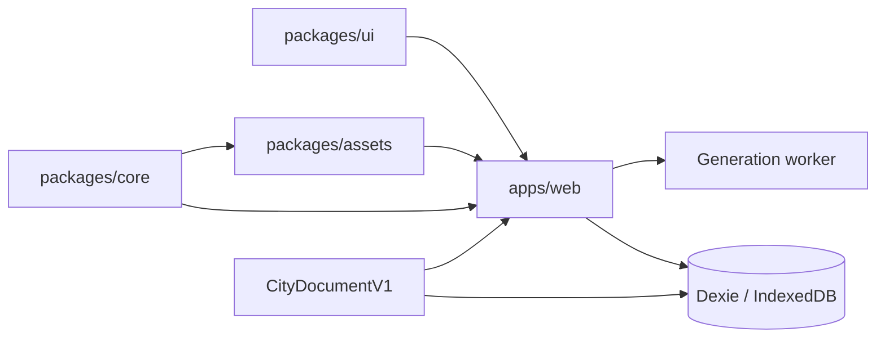
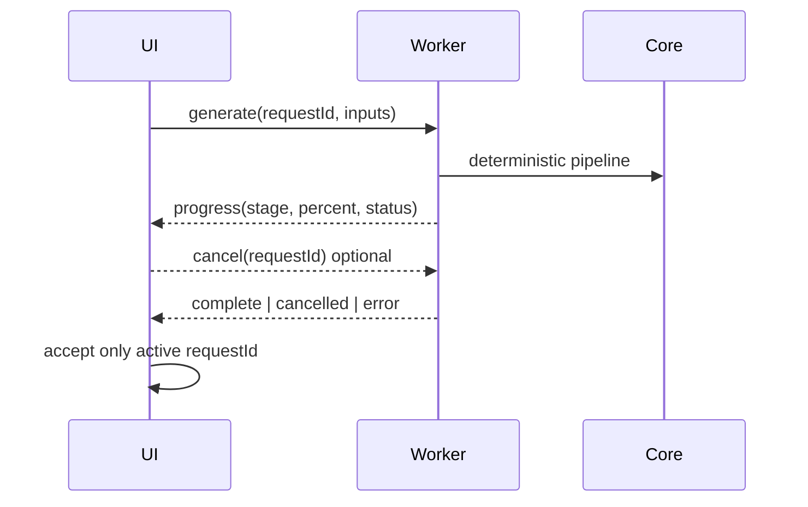

# Architecture

## Boundaries

- **ARC-001:** `packages/core` owns pure domain rules, deterministic generation, commands, validation, and migrations.
- **ARC-002:** `packages/assets` owns generated catalog metadata, overrides, validation, and runtime copying.
- **ARC-003:** `packages/ui` owns accessible reusable presentation without domain state.
- **ARC-004:** `apps/web` composes routes, workers, persistence, and rendering.
- **ARC-005:** `CityDocumentV1` is the single persisted source of truth; scene graphs, spatial hashes, instance maps, and thumbnails are derived.
- **ARC-006:** Generation runs in one worker with discriminated, Zod-validated messages and active-request filtering.
- **ARC-007:** State uses Zustand with Immer at application boundaries; domain functions remain framework-independent.

## Generation lifecycle

## Dependency rule

Dependencies point inward toward core contracts. Core never imports browser, rendering, persistence, or UI modules. Runtime asset paths are catalog-driven and no application feature reaches into original pack folders directly.
