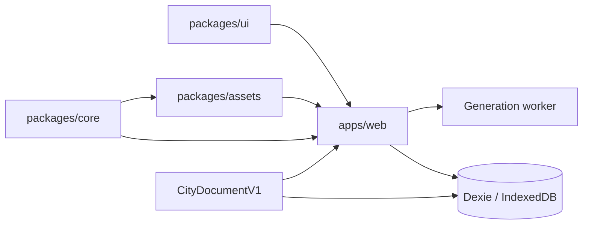
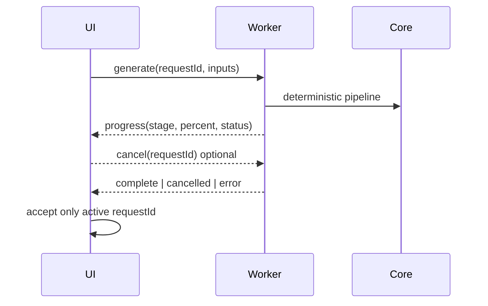

# Architecture

## Boundaries

- **ARC-001:** `packages/core` owns pure domain rules, deterministic generation, commands, validation, and migrations.
- **ARC-002:** `packages/assets` owns generated catalog metadata, overrides, validation, and runtime copying.
- **ARC-003:** `packages/ui` owns accessible reusable presentation without domain state.
- **ARC-004:** `apps/web` composes routes, workers, persistence, and rendering.
- **ARC-005:** `CityDocumentV1` is the single persisted source of truth; scene graphs, spatial hashes, instance maps, and thumbnails are derived.
- **ARC-006:** Generation runs in one worker with discriminated, Zod-validated messages and active-request filtering.
- **ARC-007:** State uses Zustand with Immer at application boundaries; domain functions remain framework-independent.

## Generation lifecycle

## Dependency rule

Dependencies point inward toward core contracts. Core never imports browser, rendering, persistence, or UI modules. Runtime asset paths are catalog-driven and no application feature reaches into original pack folders directly.

M3.6.2 derives one `DriveNetwork` in `@city/core` from persisted `RoadTopology` plus generated catalog `driveProfile` / `vehicleBounds`. The web view shares that network between the vehicle mover, Traffic lanes overlay, and inspector. Core has no React or Three.js dependency. Runtime vehicles store `segmentId`, distance, and route — data that a later ECS adapter can reference without introducing components, signals, reservations, or pedestrian rule changes in this milestone. Overlay geometry is created only while Traffic lanes is on and is disposed on unmount.

M3.6.3 (ADR-015) derives PedestrianNetwork and NpcWorld alongside DriveNetwork. Plain component maps keyed by stable NPC IDs separate pose, locomotion, navigation, behavior/orders, crossing and appearance. Pure core systems mutate only the supplied runtime world; no browser or Three.js imports enter core. The web simulation owner drives both layers at fixed ticks, with interpolated render snapshots. Shared path-geometry utilities retain the vehicle API through re-exports. No new ECS dependency.
