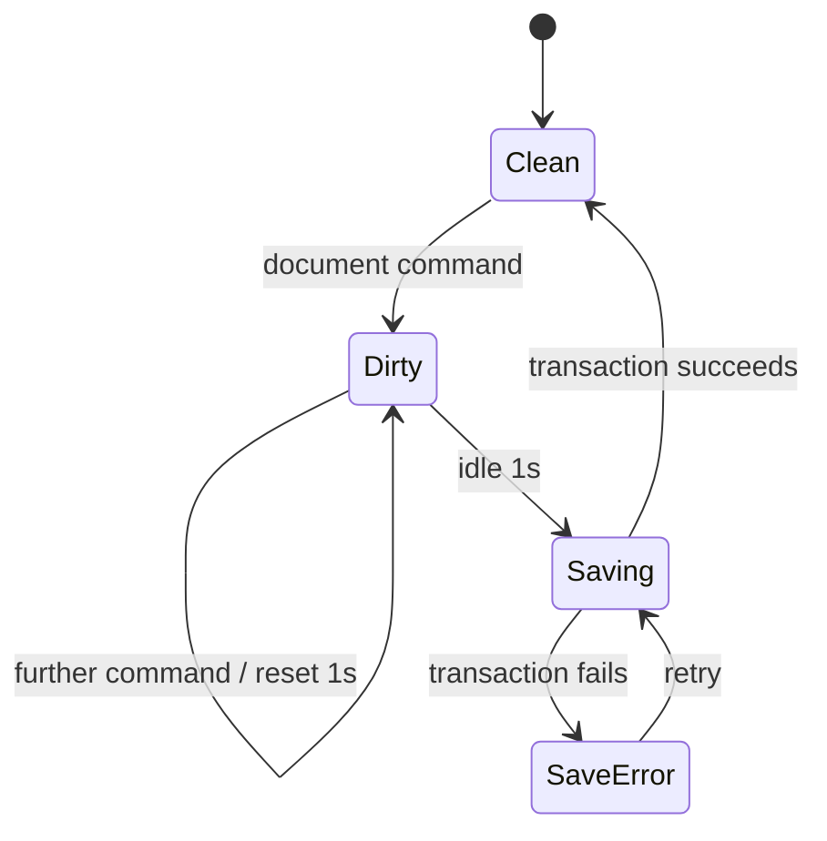

# Persistence specification

- **PER-001:** Dexie stores multiple full `CityDocumentV1` snapshots and derived thumbnails in IndexedDB.
- **PER-002:** Document mutations autosave after one second without changes; a new mutation restarts the timer.
- **PER-003:** Thumbnail capture runs after ten seconds idle, never blocks document saving, and can be recreated.
- **PER-004:** Library actions create, open, duplicate, rename, and confirm deletion.
- **PER-005:** Export emits formatted UTF-8 `.city.json` with schema, snapshot, and provenance but no undo history.
- **PER-006:** Import rejects files over 25 MB before parsing, validates schema and references, and creates a new ID/name when the ID exists.
- **PER-007:** Explicit sequential migrations accept supported older schemas. A schema newer than the application is rejected with its version and an upgrade instruction.
- **PER-008:** Storage or quota failures preserve the in-memory document and show recovery actions to export or retry.

