# Roadmap

```mermaid
flowchart LR
  M0["M0 Foundation"] --> M1["M1 Road slice"] --> M2["M2 Blocks and zoning"] --> M3["M3 Placement and rendering"] --> M35["M3.5 Urban morphology"] --> M36["M3.6 Animated agents"] --> M361["M3.6.1 Sidewalks"] --> M361A["M3.6.1 Avenues"] --> M362["M3.6.2 Vehicles"] --> M4["M4 Editor"] --> M5["M5 Local library"] --> M6["M6 Hardening / 1.0"]
```

| Milestone | Outcome | Review gate |
|---|---|---|
| M0 | Baseline, monorepo, documentation, schemas, shell, 213-asset catalog/viewer, CI, Pages | Foundation commands pass and catalog is inspectable |
| M1 | Mask, centers, gates, graph, A*, resolved road tiles, navigable small city | Determinism and road connectivity pass |
| M2 | Blocks, lots, five zones, presets, invariant validators | Batch seeds meet frontage and quota rules |
| M3 | Buildings, parks, decoration, themes, worker, instancing, graphics quality | Both backends and performance evidence pass |
| M3.5 | Closed manzanas, avenue/local tiles, connector-correct curves, ring lots | Morphology batch, connector tests, overlay screenshots |
| M3.6 | Bounded runtime pedestrians, idle/run, cell avoidance | TST-008, 8–16 agents, both backends |
| M3.6.1 | 1-cell sidewalk rings, local `*-path` / avenue unsuffixed T/4-way, two-lane sidewalk walking | TST-001/003/008, 200-city batch, both backends |
| M3.6.1 avenues | Arterial/collector 2-cell carriageways, dual nudos, local 3×3 roundabouts (GEN-028/005) | TST-001/003, 200-city batch, overlay QA |
| M3.6.2 | Bounded runtime vehicles on a validated directed lane network, cubic Bézier maneuvers, instanced Kenney Car Kit, Traffic lanes overlay | TST-009, 8–16 vehicles, both backends, overlay QA |
| M4 | Full object editor, commands, selection, placement, block regeneration | Exact undo/redo and input QA pass |
| M5 | Dexie library, autosave, thumbnails, import/export, migrations | Persistence recovery and migration QA pass |
| M6 | Accessibility, performance, final QA/docs/release | All requirements accepted; `1.0.0` may ship |

Each milestone uses its brief in `docs/milestones`, a dedicated branch and PR, and stops for review before the next begins. M3.5 (morphology), M3.6 (runtime agents), M3.6.1 (sidewalks), the M3.6.1 avenue hotfix, and M3.6.2 (vehicles) are intermediate patches; they do not replace M4.
