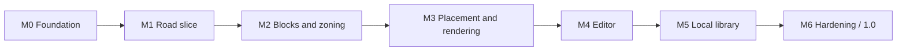

# Roadmap

| Milestone | Outcome | Review gate |
|---|---|---|
| M0 | Baseline, monorepo, documentation, schemas, shell, 213-asset catalog/viewer, CI, Pages | Foundation commands pass and catalog is inspectable |
| M1 | Mask, centers, gates, graph, A*, resolved road tiles, navigable small city | Determinism and road connectivity pass |
| M2 | Blocks, lots, five zones, presets, invariant validators | Batch seeds meet frontage and quota rules |
| M3 | Buildings, parks, decoration, themes, worker, instancing, graphics quality | Both backends and performance evidence pass |
| M4 | Full object editor, commands, selection, placement, block regeneration | Exact undo/redo and input QA pass |
| M5 | Dexie library, autosave, thumbnails, import/export, migrations | Persistence recovery and migration QA pass |
| M6 | Accessibility, performance, final QA/docs/release | All requirements accepted; `1.0.0` may ship |

Each milestone uses its brief in `docs/milestones`, a dedicated branch and PR, and stops for review before the next begins.
